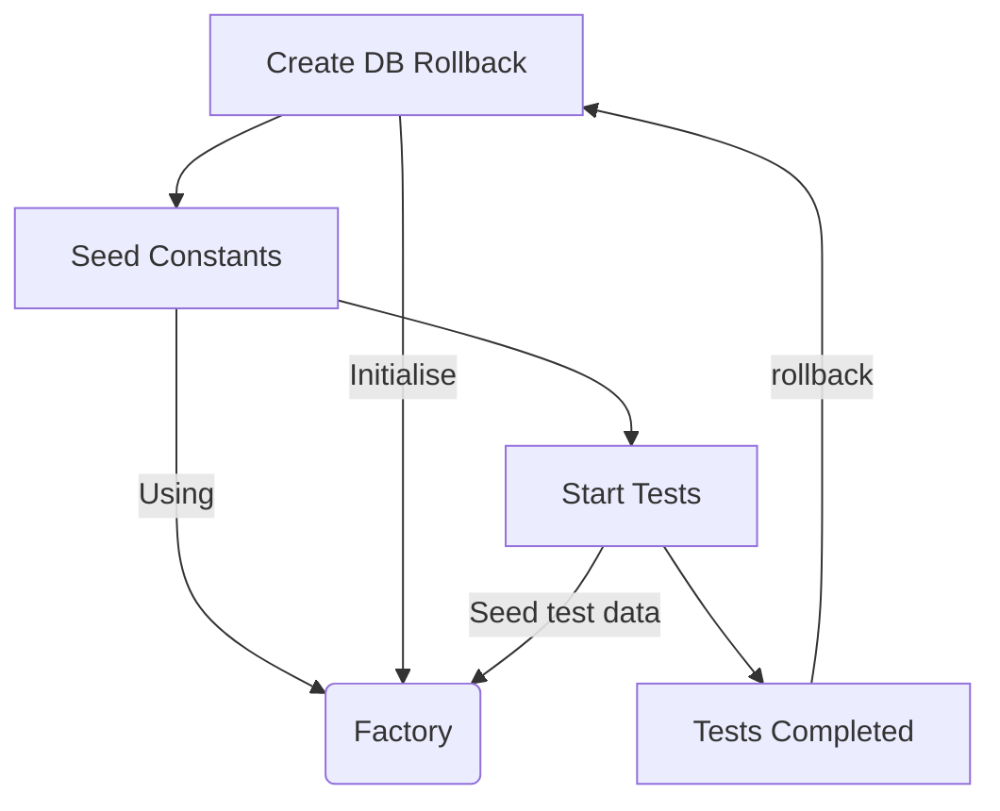

+++
title = 'Rolling: Integration Tests With SQLAlchemy'
date = 2024-06-30T14:38:52+01:00
draft = false
tags = ["python", "testing", "sqlalchemy"]
summary = 'Writing integration tests in Python using SQLAlchemy.'
+++

When I am testing my code, I want to know that it is going to work against the production database.
For obvious reasons,  I do not want to run this against the **actual** production database.

Instead my tests should run against a copy that we are safe to break without repercussion.
Additionally, we should be able to seed this test database with data of our choosing.
This is a fairly common pattern referred to as an integration test.

Despite it being a common pattern, I am yet to come across a solution I am 100% satisfied with.

## the Problem

To identify the problem, we must set the scene and define some success criteria.

### Setting the Scene

The code in question is an API (FastAPI) that acts on a database. The API uses an ORM (SQLAlchemy).
Tests are managed by pytest.

Migrations on the database are handled in a separate repo using [Flyway](https://flywaydb.org/).

Whilst this is the tech stack I use, the solution I am showing can be extended to any framework.

### Defining Success

To successfully test our code, I have defined some criteria:

- Use the most recent migration as a base for our test database.
- Data is reset between tests.
- Be able to seed different tests with different seed data.
- Easily see which tests are using which data.

This will mean that the tests are always running on an up-to-date database, and edge cases
in our system will be easy to cover.

## the Solution

Now that we have defined the problem, let's look at the proposed solution.

### Database

For the integration tests to be actually useful, they must run against the 

#### Migration

As mentioned previously, migrations are managed for the database.

During the CICD for the database migration repo, a Docker image is created of the database
each time there is a change. This image is then pushed to a repository where it can be accessed
later by the tests.

#### Testcontainer

[Testcontainers](https://testcontainers.com/) is used to run this image whenever the integration tests are run.
This ensures that tests are always run against an up-to-date database.

Here is a code example:

```py
# conftest.py
from testcontainers.postgres import PostgresContainer


@pytest.fixture(scope="session")
def db_container():
    postgres_container = PostgresContainer(
        "ghcr.io/db-migrations/db:master",
        user="postgres",
        password="password",
        dbname="postgres",
        driver="psycopg",
    )
    postgres_container.start()
    yield postgres_container
    postgres_container.stop()
```

### Seeding

A clean database has been setup. We now need to seed it with data to test against.

#### The Factory

The core of this solution is a Factory class. This is inspired by the [Factory Boy package](https://factoryboy.readthedocs.io/en/stable/),
but stripped down to the necessary essentials.

```py
# factory.py
from typing import TypeVar

from sqlalchemy.orm import Session


T = TypeVar("T")


class _Factory:
    def __init__(self) -> None:
        self.db: None | Session = None

    def add_db_connection(self, db: Session) -> None:
        self.db = db

    def seed_model(self, model: type[T], data: dict) -> T:
        if not self.db:
            raise ValueError("Session not initialised")
        record = model(**data)
        self.db.add(record)
        self.db.flush()
        return record


factory = _Factory()
```

The `seed_model` method is able to add records into the database (I will show an example later).
This utilises the SQLAlchemy models we have already defined as part of the application code.

The factory will have its database connection set during test startup.

### Testing

Now we have a database spun up and a way of seeding data, we can start testing.

#### Test Client

A [FastAPI TestClient](https://fastapi.tiangolo.com/tutorial/testing/#using-testclient)
that is connected to this database container is created as a pytest fixture and used
to mock the API.

The TestClient fixture will look something like this:

```py
# conftest.py
@pytest.fixture()
def client(db_connection: Connection):
    # needed for rollback
    db_connection.begin()

    TestingSessionLocal = sessionmaker(
        autocommit=False,
        autoflush=False,
        binds={
            DbBase: db_connection,
        },
    )

    db = TestingSessionLocal()
    # This is when the factory has it's connection set
    factory.add_db_connection(db)

    def override_get_db():
        try:
            yield db
        finally:
            db.close()

    app.dependency_overrides[get_db] = override_get_db
    client = TestClient(app)
    yield client
    db_connection.rollback()
```

A rollback is used to make sure that data is reset between each test.

#### Fixtures

To make sure our tests are readable and can be seeded with different data, I decided to
utilise [pytest fixtures](https://docs.pytest.org/en/6.2.x/fixture.html). These are built to
be explicit, modular, and scalable. This means that any code defined in a fixture will
only be run if that fixture is used in the test that is running.

### Example - Testing Users

Here is an example implementation where we are testing if a user is present.

```py
# test_user.py
@pytest.fixture
def user():
    user_obj = factory.seed(
        Annotation,
        {
            "name": "John Smith",
            "email": "jsmith@gmail.com",
        },
    )
    return user_obj


def test_get_user(client: TestClient, user: User):
    response = client.get(f"/user")
    assert response.status_code == 200
    assert response.json() == [{
        "id": user.id,
        "name": "John Smith",
        "email": "jsmith@gmail.com",
    }]


def test_get_user_with_no_users(client: TestClient):
    # notice that the 'user' fixture is not used in this test
    response = client.get(f"/user")
    assert response.json() == []
```

We can see that if the user fixture is not used, then the user is not seeded and nothing
is returned.

#### Flow Diagram

Pardon the messy diagram, but start at `Create DB Rollback` and it will help illustrate the flow that is followed for each individual test.



## Problems

Between rollbacks sequences do not reset. This means that id's will continue incrementing
if you run multiple tests at once.

You can exclude id checks in your tests. Or if you are lazy like me, you can define
a class that asserts equal to any integer.

```py
# mock.py
class SequenceMock:
    """Mock a database sequence.

    On the first assertion call, the value must be an integer.
    On subsequent calls, it must be the initial integer value that was used in the
    first assertion call.
    """

    def __init__(self):
        self.saved_value = None

    def __eq__(self, other) -> bool:
        if self.saved_value is None:
            if isinstance(other, int):
                self.saved_value = other
                return True
            return False
        else:
            return self.saved_value == other
```

## Conclusion

Whilst this solution is not perfect, it does satisfy the criteria I required for a passable
solution.

- Use the most recent migration as a base for our test database. ✅
- Data is reset between tests. ✅
- Be able to seed different tests with different seed data. ✅
- Easily see which tests are using which data. ✅

If I improve this solution or find a better one, I will update this post!
